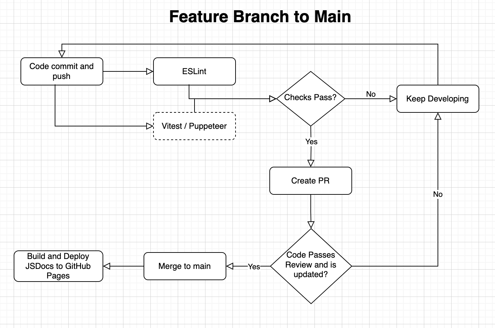

# CI/CD Pipeline Overview

## 1. Introduction

Our CI/CD pipeline is designed to maintain high code quality, ensure proper documentation, and enforce safe collaboration through code reviews. It currently automates code linting, documentation generation, and requires approval before merging pull requests.

Future enhancements include automated unit and end-to-end testing to increase confidence in code correctness and user workflows.

## 2. Pipeline Rundown

Ideally, we want our pipeline to include the following stages:

| Stage | Tool | Description | Status |
|-------|------|-------------|:--------:|
| **Linting** | ESLint | Checks JavaScript/TypeScript code for syntax errors, unused imports, and style violations. Part of status checks. | ✅ |
| **Documentation** | JSDoc | Generates developer-friendly API documentation from annotated code. The documentation is automatically deployed to GitHub Pages via a GitHub Actions workflow when changes are pushed to `main`. | ✅ |
| **PR Review** | GitHub Pull Request Checks | Requires code review approval and status checks passing before merging into main branch. | ✅ |
| **Unit Tests** | Vitest | Automated tests for individual modules and components to detect regressions. | ✅
| **E2E Tests** | Puppeteer | Automated browser-based tests to validate full application workflows. | ❌

## 3. Functional Stages
### Linting and Code Quality — ESLint

We use [ESLint](https://eslint.org/) to enforce a consistent JavaScript style and prevent common programming mistakes.

#### Why ESLint
- Detects bugs and code smells early in development
- Encourages a uniform code style across contributors
- Enforces rules such as:
  - No duplicate or unused imports
  - Consistent indentation and spacing
  - CamelCase naming
  - No accidental `console.log` in production

#### How It’s Configured
- The ESLint flat configuration (`eslint.config.js`) defines base rules and ignores `node_modules` and build outputs.
- Runs automatically in CI to ensure commits follow style guidelines.
- Developers can run `npm run lint` locally before committing changes.

### Documentation — JSDoc

We use [JSDoc](https://jsdoc.app/) to automatically generate HTML documentation from inline comments in our JavaScript code.

#### Why JSDoc
- Provides a clear, centralized reference for functions, classes, and modules  
- Encourages consistent documentation across all components  
- Helps new contributors understand the API quickly  
- Supports examples, types, and modular organization for complex projects  

#### How It’s Configured
- Configuration is defined in `jsdocs.json`
- Generates HTML documentation automatically via `npm run docs`  
- Deployed to [GitHub Pages](https://cse210-fa25-team07.github.io/conductor-tool/) using GitHub Actions, so the latest docs are always available online
- Supports modular design using `@module` and `@memberof` tags to group functions and classes logically 

### Testing — Vitest

We use [Vitest](https://vitest.dev/) as our test runner to validate JavaScript code.

#### Why Vitest
- Provides **fast and reliable unit and integration testing**.
- Integrates seamlessly with modern front-end and back-end projects.
- Supports features like:
  - Mocking modules and functions
  - Asynchronous testing for API/database interactions

#### Integration Testing with Supertest
- For backend API tests, we use [Supertest](https://www.npmjs.com/package/supertest) alongside Vitest.
- Supertest allows tests to make **HTTP requests** directly to our server without needing it to run on a network port.

#### How It’s Configured
- The configuration file (`vitest.config.js`) sets test environment, globals, and coverage options.
- Tests are automatically run in CI to prevent regressions.
- Developers can run `npm run test` locally to execute all tests.

### PR Review

Branch protection rules are enabled on the main branch to enforce:
- Required PR reviews before merging
- Passing CI checks (e.g., linting)
- Branch must be up to date (e.g. new tests, linter rules)

### Why PR Review
- Prevents direct pushes to main
- Guarantees all code is peer-reviewed and passes automated checks
- Maintains repository integrity

## 3. Planned / In-Progress Enhancements

We are actively planning the following improvements:

- **Unit Testing (Vitest)**: Automated tests for individual modules and components to detect regressions.  
- **End-to-End Testing (Puppeteer)**: Automated browser-based tests to validate full application workflows. However, there may be issues testing with Google OAuth.

## 4. Pipeline Diagram

**Diagram Details:**  
- The pipeline starts with code commits that are pushed to the feature branch.  
- On push, GitHub Actions runs ESLint and Vitest test cases (perhaps Puppeteer in the future). If devs create a PR, these Actions will run as checks.
- PRs must have checks pass to merge. In addition, a reviewer must approve of the PR and the feature branch must be up to date with main.
- Arrows indicate the flow of operations from code submission to merge.
