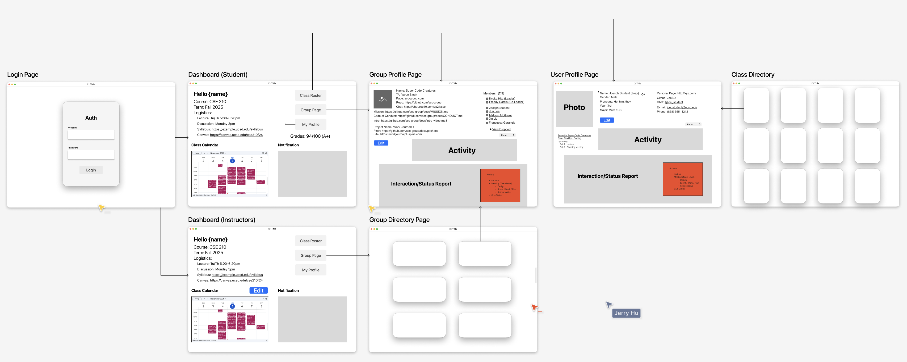
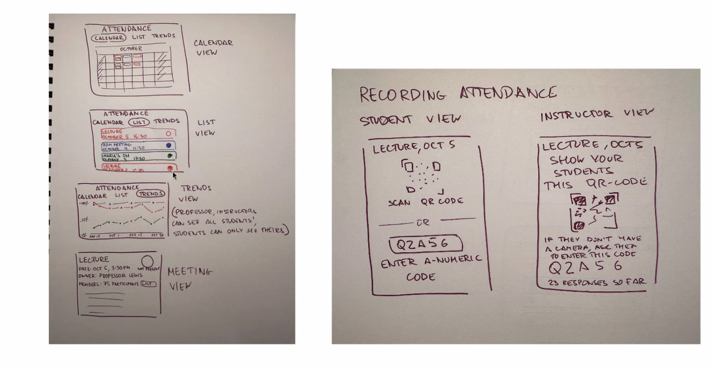
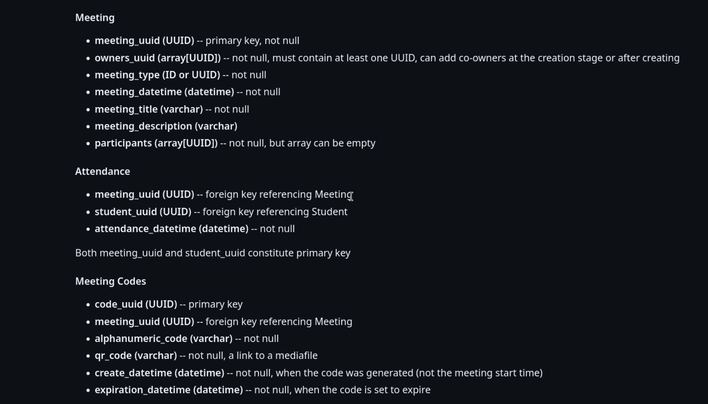

# Sprint 1 Review  
**Meeting Date:** November 7, 2025  
**Attendance:** Braxton, Rhea, Wayne, Yuri, Jialuo, Gaurav, Sree, Will, Emma, Win, Luting, Ethan, Cole  

---

## Agenda

- Sprint Review  
- Feature Team Updates  
- Key Features & Integration  
- Inter-team Dependencies  
- Feature Scope & Work Split  
- DevOps Progress  
- App Structure & Database Discussion  
- Implementation Steps  
- Building Flexibility (“Elastic Design”)  
- Prep for Stakeholder Demo (Nov 13)  
- Individual Feature Skeleton UI & Placeholders  
- Repo Rules  
- Sprint Retrospective  
  - What went well?  
  - What can be improved?  
  - Points of confusion, obstacles, or concerns  

---

## Team Updates

### **Login / Auth Team**

- Handling login/signup page  
- Defined user roles:
  - **Admin:** add users directly (Professors), check request forms, change roles, remove users  
  - **Student:** role assigned after course enrollment  
- Built landing page/dashboard — different views for professors vs. students (similar to Canvas or Gradescope)

---

### **Directory Team**

- Implementing **Class Calendar** (similar to Google Calendar)  
- Has a **complete workflow**

---

### **Attendance Team**

- Focused on **Architecture Decision Records (ADRs)** this week  
- Has a complete workflow  
- Intends to implement as a **microservice**  
- Attendance visualized as **calendar**  
- Can take attendance via **QR code** or manually  
- Own feature-specific **database schema**

  

---

### **Stand-Up Team**

- Has **complete demo/workflow**  
- Demo link: [GitHub - Conductor Tool HTML Demo](https://github.com/CSE210-fa25-team07/conductor-tool/tree/html-demo)

---

## App Structure

- [Miro Board](https://miro.com/online-whiteboard/board/uXjVJuZPYFE=/?boardAccessToken=3yac6enQ3OjTqucESN10shnlemX3Ea3e)

---

## Next Thursday Presentation — To-Dos

### **User Management & Authentication**
- Login + authentication demo  
- Share user database with Class Directory team  

### **Class Directory**
- Dashboard skeleton  
- Initial user profile pages  

### **Attendance**
- Mock calendar  
- Mock meeting data  
- Mock people data  

### **Work Journal**
- Refine demo  

**References:**
- [Conductor Tool HTML Demo](https://github.com/CSE210-fa25-team07/conductor-tool/tree/html-demo)  
- [Miro Board Link 1](https://miro.com/online-whiteboard/board/uXjVJuZPYFE=/?boardAccessToken=3yac6enQ3OjTqucESN10shnlemX3Ea3e)  
- [Miro Board Link 2](https://miro.com/online-whiteboard/board/uXjVJuZPYFE=/?boardAccessToken=3yac6enQ3OjTqucESN10shnlemX3Ea3e)

---

## CI/CD — *Ethan*

- GitHub workflow using **linting**  
- **Human review** in pipeline  
- **JSDocs** documentation support  

