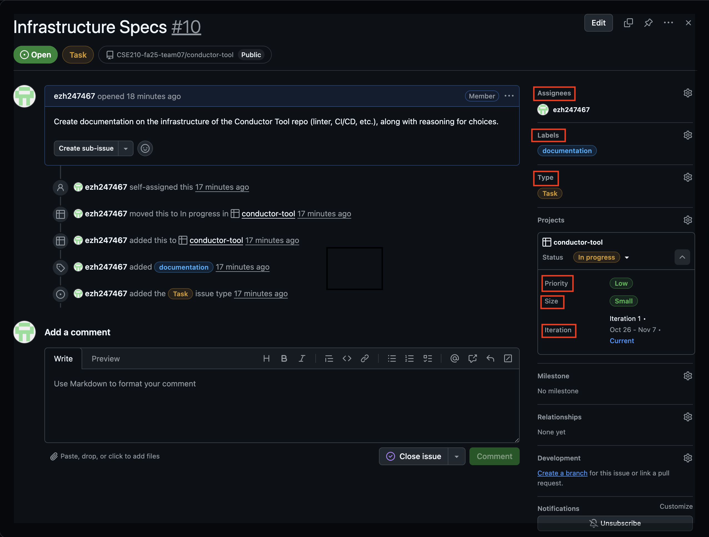

# Project Infrastructure Overview

This document describes the development infrastructure, tools, and conventions used in this repository.  
It aims to provide both contributors and maintainers with a clear understanding of why each tool or workflow exists and how it supports a consistent, maintainable, and high-quality development process.

## Overview

Our project uses a lightweight but structured setup centered around:
- Code quality enforcement (ESLint)
- Process consistency (GitHub Projects + templates)
- Collaboration control (Pull request templates + branch protection)

This setup ensures all code changes go through consistent quality checks and that work items are clearly defined, traceable, and reviewable.

## Linting — ESLint

We use [ESLint](https://eslint.org/) to enforce a consistent JavaScript style and prevent common programming mistakes.

### Why ESLint
- Detects bugs and code smells early in development
- Encourages a uniform code style across contributors
- Enforces rules such as:
  - No duplicate or unused imports
  - Consistent indentation and spacing
  - CamelCase naming
  - No accidental `console.log` in production

### How It’s Configured
- The ESLint flat configuration (`eslint.config.js`) defines base rules and ignores `node_modules` and build outputs.
- Runs automatically in CI to ensure commits follow style guidelines.
- Developers can run `npm run lint` locally before committing changes.

## Documentation — JSDoc

We use [JSDoc](https://jsdoc.app/) to automatically generate HTML documentation from inline comments in our JavaScript code.

### Why JSDoc
- Provides a clear, centralized reference for functions, classes, and modules  
- Encourages consistent documentation across all components  
- Helps new contributors understand the API quickly  
- Supports examples, types, and modular organization for complex projects  

### How It’s Configured
- Configuration is defined in `jsdocs.json`
- Generates HTML documentation automatically via `npm run docs`  
- Deployed to [GitHub Pages](https://cse210-fa25-team07.github.io/conductor-tool/) using GitHub Actions, so the latest docs are always available online
- Supports modular design using `@module` and `@memberof` tags to group functions and classes logically 

### How to Use (for Devs)
- Run `npm run docs` locally to preview documentation  
- Navigate to the generated `./docs/index.html` to view the full HTML documentation 
- - Use `@module`, `@param`, `@returns`, `@example`, and `@memberof` in code comments to enhance docs (example below)
```
/**
* @module {moduleName} - Define in only one file
*/

/**
 * [Short description of the function]
 *
 * @param {TYPE} param1 - [Description of parameter]
 * @param {TYPE} param2 - [Description of parameter]
 * @returns {TYPE} [Description of return value]
 * @memberof module:{moduleName} - Only for other files
 *
 * @example
 * // Example usage
 * const result = functionName(arg1, arg2);
 */
function functionName(param1, param2) {
  // function body
}
``` 

## Project Management — GitHub Projects (Iteration Taskboard)

We manage all work using GitHub Projects with the Iteration Taskboard view.

### Why GitHub Projects
- Provides visual tracking of progress (To Do → In Progress → Done)
- Integrates tightly with Issues and Pull Requests
- Enables iteration-based planning and prioritization
- Reduces dependency on external project management tools

Each card in the taskboard is a GitHub Issue that describes a user story, bug report, or feature request, ensuring a single source of truth for work tracking.  In order to organize and contextualize issues, we ensure that the fields that are boxed in red below are typically filled.



## Issue Templates

To keep our issue tracking structured and consistent, we use GitHub Issue Templates for:
- User Stories  
  Defined in “As a [user], I want [goal], so that [benefit]” format, including acceptance criteria checklist.
- Bug Reports  
  Captures reproduction steps, expected vs. actual behavior, and environment details.
- Feature Requests  
  Used for proposing and scoping new enhancements.

### Why Templates
- Maintains a consistent reporting format
- Reduces missing information in submissions
- Simplifies triage and prioritization

All templates are located under `.github/ISSUE_TEMPLATE/`.

## Pull Request (PR) Template

Pull Requests are the primary way to merge code into protected branches.

### What the Template Includes
- Summary of changes
- Type of change (feature, bug fix, refactor, etc.)
- Checklist for testing, documentation, and review readiness

### Why a PR Template
- Ensures every change is well-documented before review
- Promotes thoughtful, reviewable commits
- Encourages consistent collaboration and traceability

## Branch Protection

Branch protection rules are enabled on the main branch to enforce:
- Required PR reviews before merging
- Passing CI checks (e.g., linting)
- Branch must be up to date (e.g. new tests, linter rules)

### Why Branch Protection
- Prevents direct pushes to main
- Guarantees all code is peer-reviewed and passes automated checks
- Maintains repository integrity

## Future Enhancements

We plan to expand this infrastructure to include:
- Unit Testing, possibly *Vitest*
- E2E testing, possibly *Puppeteer*

These additions will further strengthen our code quality and transparency.
