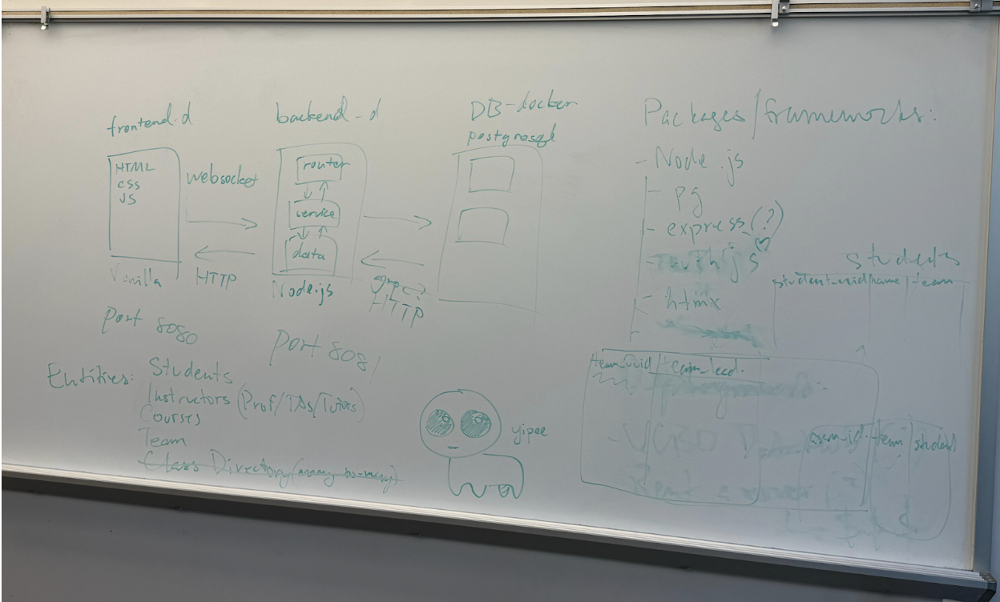

**Meeting 10/31/2025**  
Attendance: Ethan Huang, Cole Carter, Braxton Conley, Luting Lei, Jialuo Hu, Win Htet Aung, Rhea Senthil Kumar, Sree Teja Nadella, Will Luo, Yuri Bukhradze, Emma Zhang, Gaurav Joshi

1. Define overall system requirements for conductor app  
   1. [https://tpowell.craft.me/xXuZoY59NY9R36](https://tpowell.craft.me/xXuZoY59NY9R36)   
2. Understand everyone’s time commitment and review time allotted for each feature  
   1. User Management \+ Authentication: \~16 hrs/week  
   2. Class Directory: \~12 hrs/week   
   3. Attendance System: \~18 hrs/week  
   4. Work Journal/Stand Up Tool: \~15 hrs/week  
3. Split into feature subteams.  
   1. Based on feature time allocation, define functional requirements.   
   2. Define system requirements and scope features  
   3. Discuss points of risk and rabbit holes  
   4. Where in the system does the feature fit? How does a user get to it? What are the key components/interactions? Where does it take the user?  
4. Come back to the larger group, where subteams get feedback on feature design.  
   1. Point out good design features, places of improvement and risk.  
   2. See if there is anything missing in the design.   
   3. Go through use cases. How will a user go through the feature from beginning to end  
5. Organize app’s visual design in a wireframe  
   1. Start from here: [https://miro.com/app/board/uXjVN4iTFac=/?share\_link\_id=983680778424](https://miro.com/app/board/uXjVN4iTFac=/?share_link_id=983680778424)   
   2. Think about places (things the user navigates to i.e. screens, menus, dialogs), affordances (things the user acts on i.e. buttons, fields), connection lines (how affordances take user from place to place)  
6. Define project roadmap, milestones, and timeline  
   1. Build buffers into schedule  
7. Review and delegate pitch write-up  
8. Misc. tasks  
   1. Group calendar?

**Notes:**  
Deployment cost?  
Platform tech: HTML, CSS, VanillaJS, Postgre   
MVC model with separate frontend, backend, and database

- Frontend docker (HTML, CSS, VanillaJS) (Port 8080\)  
  - Websocket  
- Backend docker (NodeJS) (Port 8081\)  
  - Router  
  - Service  
  - Data   
- DB docker (Postgres) (HTTP)

**System Requirements**

- OS  
  - Web application  
- Browsers  
  - Should work on all of them  
- Frameworks/libraries  
  - HTML  
    - Standard tags  
  - CSS  
    - No absolute pixel  
  - VanillaJS  
  - NodeJs  
    - Postgres  
    - Auth.js  
    - ExpressJS  
    - Htmx  
- Databases  
  - Postgres DB  
- Cloud/Hosting  
  - For now, local server  
  - Look into UCSD services for hosting  
- Dependencies  
  - Postgres  
  - Auth.js  
  - HTMX

Has to support 1000 users.  
No business logic in the frontend. (Just a pure interface for the users)

**DB structures:**

- Entities  
  - Students  
  - Instructors (Prof/TAs/Tutors)  
  - Courses  
  - Team

**App Structure:**  
Class Directory \- Main UI and Interface  
User Management \- Visibility based on roles  
Attendance \- In charge of Calendar  
Standup/work journal  \- Activity section

**Project Timeline:**  
November 1-13: Work on features and flush out details  
November 14: Project midway check-in

- Barebone features  
- Fill in all the placeholders

November 24-28: Main/Integration testing  
Dec 5th: Done with the project (Technical wise)

Questions:

- Should the instructors have access to all the team’s standup/work journals or just the teams themselves? (Who else can see the standup journal except for the student?)  
- How much admin power does the instructor have? (What features of students should be hidden/readable from the instructor?)

App Implementation Visual:  

**User Management & Authentication**  
Functional Requirements

- **User Authentication**: System must verify users are associated with UCSD through email-based authentication  
- **Multiple Authentication Paths**: Support both UCSD students (with UCSD email) and extension students (without UCSD email)  
- **Verification Code System**: Implement role-specific verification codes distributed through Canvas/Slack to assign appropriate user role automatically  
- **Manual Approval Workflow**: System administrator can manually review and approve extension student requests  
- **Google Authentication Integration**: Support Google-based sign-in for approved users  
- **Role-Based Access Control**: Implement six-tier user hierarchy (System Administrator, Instructor, TA, Tutor, Team Leader, Student)  
- **User Management**: Store and manage user attributes including role and permissions  
- **Role Assignment/Modification**: Higher-level users can configure, assign, and delete lower-level user roles  
- **Team and Group management**: Instructors and TAs can assign and reassign Team Leaders and student groups  
- **User Removal**: Ability to remove users who drop the class or join accidentally

System Requirements

- Database  
- Email System  
- Request Form System  
- Google Authentication API  
- Admin dashboard  
- Role Configuration Interface  
- Sign-up/in UI

Risks

- **Verification Code Sharing:** Students may share verification codes with non-enrolled individuals, creating unauthorized accounts  
- **Multiple Administrator Security**: Unclear consequences of having multiple system administrators or transferring administrator privileges  
- **Extension Student Bottleneck**: Manual approval process for extension students could create delays if administrator is unavailable

Feature Flow  
UCSD Student Authentication Flow:

1. User accesses sign-up page  
2. User clicks "Sign in with Google" using their UCSD email  
3. Google authenticates and returns user profile (name, email automatically obtained)  
4. User enters role-specific verification code (obtained from Canvas/Slack)  
5. System automatically assigns appropriate role based on verification code  
6. User account is created and can access the system  
7. Future logins: User simply uses "Sign in with Google"

Extension Student Authentication Flow:

1. User accesses request form  
2. User clicks "Sign in with Google" using their school-associated email  
3. Google authenticates and returns user profile (name, email automatically obtained)  
4. User enters verification code to submit enrollment request form  
5. System administrator receives and reviews request  
6. Administrator verifies enrollment eligibility and manually approves user in database  
7. User receives approval notification  
8. User signs in using Google authentication (same account used for request)  
   

User Management Flow:

1. Administrator/Instructor/TA accesses user management dashboard  
2. View list of users and their current roles  
3. Select user to modify (only users below their hierarchy level)  
4. Perform action: assign role, modify role, assign to team/group, or delete user  
5. For team assignments: select students and assign Team Leader and group  
6. For reassignments: modify existing team/group assignments  
7. Changes are saved to database and reflected in user profiles

**Class Directory**  
Functional Requirements

**Standup Subteam**  
Functional Requirements

- Be able to record what was accomplished each day  
- Sentiment logging  
- (Slack integration) to reach out to professors, TA’s, and other students. Plug in play.  
- Automated standup reminders (based on time of day)  
- Focus on ease of access for students.

System Requirements

- Feature specific database schema  
- API and integrations (github, slack)  
- Analytics for sentiment analysis, participation, etc.

Risks and rabbit holes

- Privacy (sentiment analysis probably should not be visible to teams members)  
- Notifications (If possible users should be able to turn off)  
- Limitations to plug in play integration  
- Engagement (gamify completing daily standups)

System placement and Flow  
Student

- Team dashboard \-\> Standup Form \-\> Team Dashboard

	TA, Professor

- All teams dashboard \-\> Specific Team Dashboard \-\> Specific Student Journals and sentiment

**Attendance System**  
Functional requirements:

- Recording attendance/activity per meeting  
- Different types of meetings (Lecture, Office Hours, Team Meeting, etc.)  
- Ability to record who is expected to attend the meeting (i.e. members)  
- Insights on attendance over time  
- Keeping track of meetings using some sort of a calendar system  
- Instructors (or team leads) should have the ability to change the attendance status for meeting members  
- Students should be able to see their attendance at a glance  
- Ability to record attendance fast (\<1 minute)  
  - Using QR-code or a alphanumeric code that expires after some time to allow for fast, time and place specific proof of attendance  
- Ability to submit feedback/attendance reevaluation request (i.e. if the student was present but was mistakenly marked as absent, there should be an ability to report a problem)  
- Meeting invitations/notifications

System requirements:

- Database for storing meetings, attendance, etc.  
- Real-time attendance recording (i.e. websocket)

Risks/Rabbit holes:

- Recording attendance of many (200+) students at the same time fast, without loss of data (i.e. what if the app crashes while the attendance is being recorded, and nothing is saved to the database)  
- Clean and intuitive interface so the student knows where they are supposed to be at the time, and if their attendance was properly recorded  
- Determining that the student is actually present in the meeting physically (if the meeting is physical)

In-scope/Out-of-scope:

- What if a student is late?  
- Notification delivery/reliability

Sprint 1

- Meeting creation/management system  
- Ability to record and update attendance manually on instructor’s side

Sprint 2

- Automatic/student-side attendance recording (i.e. using qr code/alphanumeric code)  
- Calendar view to see upcoming and past meetings/attendance

Sprint 3

- Attendance insights over time  
- 

Sprint 4

- Additional features

Questions:

1. Should there be an ability to record attendance more than once per meeting?  
2. Should absence be recorded or only presence?  
3. Should only meeting attendance be recorded or all kinds of actions/ interactions?